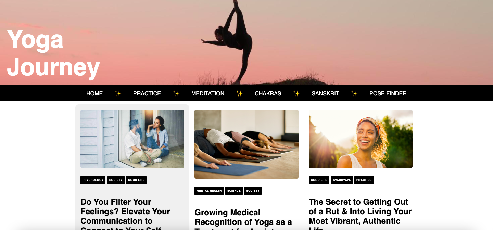
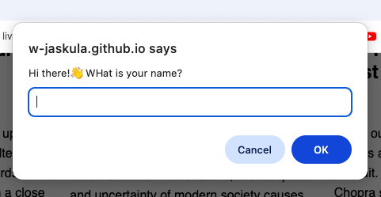

# 🧘‍♀️ Yoga Journey (Landing Page)

🚀 [Live Demonstration](https://w-jaskula.github.io/shecodes-project/)

## Overview
A responsive frontend landing page built as part of the SheCodes workshops. The project focuses on the core fundamentals of web development, responsive semantic layouts, typography, and basic user interaction.

## Visual Preview

### Web Interface

### JavaScript Interaction

## Technologies Used
* **Frontend & Logic**: HTML5, CSS3, JavaScript (Vanilla JS)
* **Design System**: Responsive Grid/Flexbox Layouts, Custom Typography
* **Coursework**: SheCodes Workshop Certification

## Key Features
* **Dynamic Interaction**: Implemented Vanilla JavaScript prompts to interact with users upon entering the landing page.
* **Semantic Structure**: Built a clean HTML5 hierarchy tailored for structured, text-heavy content sections (Psychology, Mental Health, Svadhyaya).
* **Responsive Architecture**: Engineered a fully adaptive UI with optimized image scaling and media queries across device viewpoints.

## How to Run & Deployment

### Local Execution
Since this project is built entirely using native web technologies, it requires no external compilers or runtime environments:
1. Clone or download the repository.
2. Open the `index.html` file directly in any modern web browser via double-click.

### Cloud Production
The application is automatically built and continuously deployed via **GitHub Pages**. Any changes pushed to the main branch are instantly processed and reflected on the live URL.
